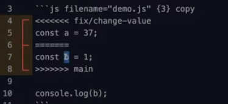
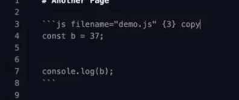

#### conflicts occurance
- let cal.com repo has 2 issue 
  issue#1 
  this issue req changes on line 32
  ie change var a to b

  issue#2
  this issue also req changes on line 32
  change value 1 to 37 

- now user1 work on issue#1 and user2 works on issue#2

- now user 1 makes  a branch and solves the issue  user1/fix... --> cal/main
 and makes a PR which is open

where as user2 is still working on issue2 jo wahi original line h 
and now user2 makes a PR  
user2/fix... --> cal/main 

ab user1 ki PR merge ho gyi

- now if we try to merge user2 PR then there will be conflict as user2 ki PR mae user1 ke changes th h nhi 
  now github is confused ki kisi PR merge karu 

` now user2 have to resolve the conflict user2 ki files changed mae kuch aisa dhkega`  

` now user2 have to wisely deal with coonflict 
as see line 10 mae koi conflict nhi aaya h 
means ki kuch wisely change krna hoga`  
ie -->  
now user1 ki PR ka bhi dhyan rhkha ar apna PR bhi sahi kar liya 

conflicts ko github se nhi vs code se solve karenge 

- after user1 PR merge 
  user2 wants to merge its PR also then after makinging changes 
  `git pull upstream main`
// upstream ke main ko local machine se merge krne ka try kr rhe h 

now it shows merge conflicts 
user2 have to wisely handle conflicts 
 
'git add .'

'git rebase --continue'

'commit message'

'git status'

'git push -f'

